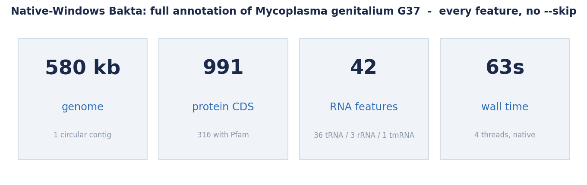
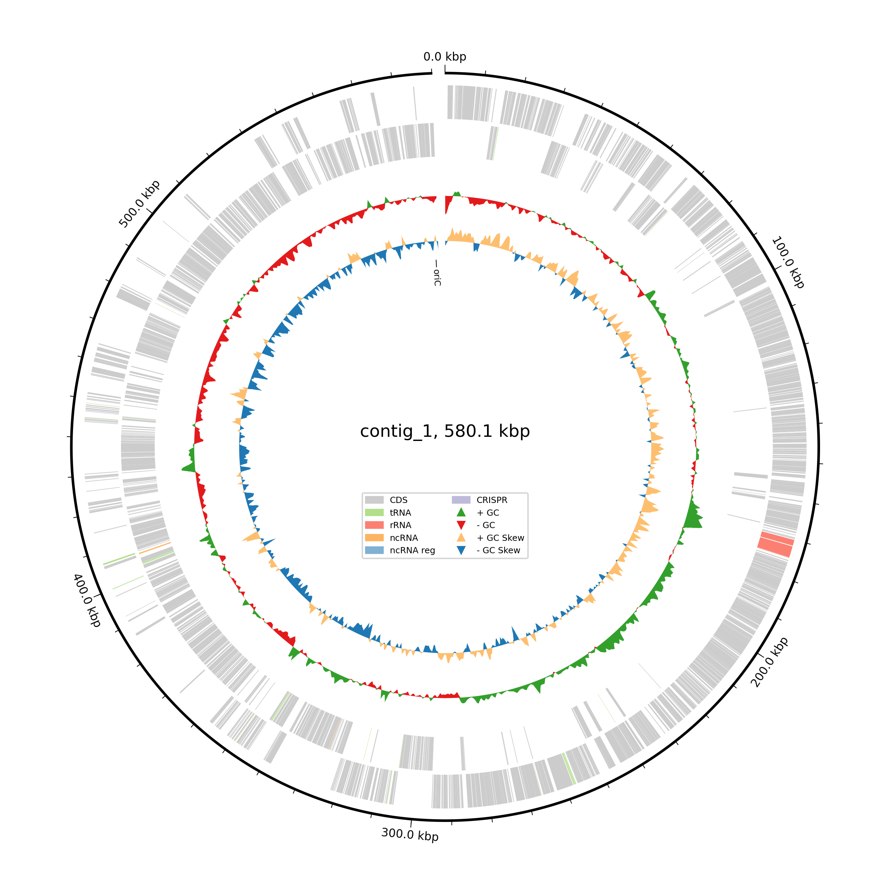
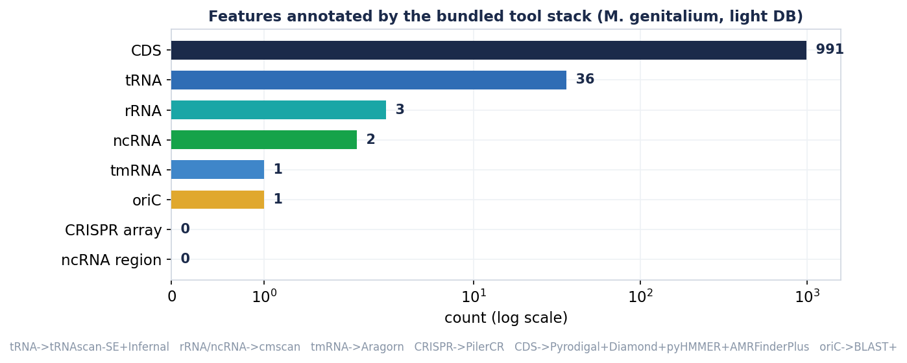
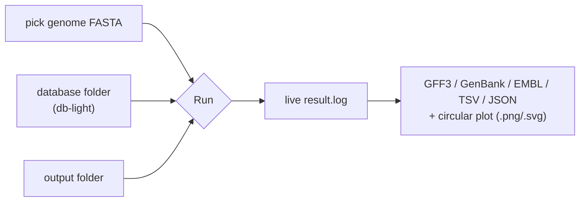
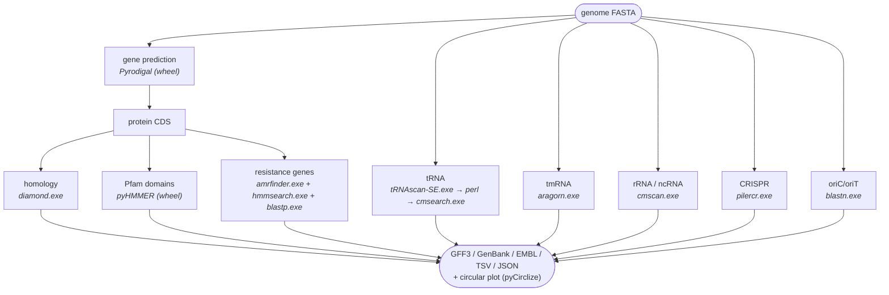

# Bakta for Windows

[](https://doi.org/10.5281/zenodo.20582182)

**A native-Windows build of [Bakta](https://github.com/oschwengers/bakta) — rapid,
standardized annotation of bacterial genomes, MAGs and plasmids — with its *entire*
tool stack ported to run natively. No WSL, no Docker, no Cygwin, no Linux VM.** A
one-click installer, a point-and-click GUI, and a command line that work on a stock
Windows 10/11 machine. Every ported binary is **fully statically linked**: it depends
only on DLLs that ship with Windows.

> Bakta orchestrates a dozen tools — gene prediction, protein homology search, HMM
> domains, antimicrobial-resistance detection, and tRNA/tmRNA/rRNA/ncRNA/CRISPR
> finders — then writes GenBank/EMBL/GFF3/JSON plus a circular genome plot. Bakta
> itself is Python and runs on Windows; the hard part is that **most of the tools it
> shells out to are Unix-only**. This repo ports them to native Windows, wires them
> together, and validates the whole pipeline on a real genome.

Ported from **Bakta 1.12.0** with the **light database v6.0**. Annotation behaviour is
unchanged — this is a port, not a fork.

---

## Headline result — full annotation, every feature, native Windows

A complete Bakta run on *Mycoplasma genitalium* G37 (580 kb, ENA `L43967.2`) on
Windows 11 — **with no `--skip` flags, so every single feature tool executed**:



The circular genome plot below is the **actual `pyCirclize` output from that run** —
CDS, RNA features, GC content and GC skew, rendered natively on Windows:

<p align="center"></p>

Every feature class was annotated by the ported tool stack:



| feature | count | tool (native Windows) |
|---|---|---|
| protein CDS | **991** (316 with Pfam) | Pyrodigal → Diamond → pyHMMER → **AMRFinderPlus** |
| tRNA | **36** | **tRNAscan-SE 2.0.12** + **Infernal** |
| rRNA (16S/23S/5S) | **3** | **Infernal `cmscan`** |
| ncRNA (RNase P, SRP) | **2** | **Infernal `cmscan`** |
| tmRNA (ssrA) | **1** | **Aragorn** |
| CRISPR arrays | 0 (searched) | **PilerCR** |
| oriC | **1** | **BLAST+** |
| **wall time** | **~63 s** | 4 threads |

All 11 output formats were written (`.gff3 .gbff .embl .faa .ffn .fna .tsv .json
.txt` + hypotheticals + the `.png`/`.svg` plot), with **zero warnings or errors**.

---

## Install (one click)

Download **`Bakta-Windows-1.12.0-Setup.exe`** from the
[**Releases**](https://github.com/MrMufasii/Bakta-for-Windows/releases) page and run it.
It bundles the ported binaries, a private **embedded Python** with Bakta and all its
packages, a **Strawberry Perl** runtime (for tRNAscan-SE), and the GUI — nothing needs
to be pre-installed. (You can also rebuild it yourself — see [`dist/`](dist).) Per-user install by default (no administrator required); it adds a
Start-Menu app, an optional desktop shortcut, and (optionally) puts `bakta` on PATH.

> **The database is separate** (too large to bundle, and versioned independently of the
> code). Both the **light** DB (~1.5 GB download / ~3 GB on disk) and the **full** DB
> (~38 GB / ~75 GB, maximal sensitivity) are supported — the ported tools are identical
> for both. After installing, open the app and click **“Download light DB…”** (it offers
> light *or* full), or run `bakta_db download --type light --output DBDIR` (or
> `--type full`). Then point the app / `--db` at the resulting `db-light` (or `db`) folder.

---

## Use it

### The app (for everyone)

Launch **“Bakta for Windows (app)”** from the Start Menu: pick your genome FASTA, an
output folder, your database folder, optionally fill in genus/species, and click
**Run**. Progress streams live; when it finishes, **Open output folder** and **View
genome plot** are one click away.



The GUI is pure PowerShell + WinForms (built into Windows — no extra runtime); it drives
the bundled `python -m bakta.main`, launched console-less via a tiny `.vbs` shim.

### The command line

If you ticked “Add Bakta to my PATH”, or from the **Bakta Command Prompt** shortcut:

```bat
bakta --version
bakta --db DBDIR\db-light --output out --threads 8 --prefix sample genome.fasta
bakta --db DBDIR\db-light --genus Escherichia --species coli --complete -o out genome.fasta
```

The full Bakta CLI is intact (`bakta --help`): `--genus/--species/--strain`,
`--complete`, `--keep-contig-headers`, `--translation-table`, every `--skip-*`, etc.

### Without installing

The repo ships the ported tools (`bin/`) and the Perl runtime (`perl/`). With any
system Python 3 that has Bakta installed (`pip install bakta`), put `bin\` on PATH and run:

```powershell
$env:PATH = "$PWD\bin;$PWD\bin\blast\ncbi-blast-2.17.0+\bin;$PWD\perl\bin;$env:PATH"
python -m bakta.main --db DBDIR\db-light -o out --threads 8 genome.fasta
```

---

## Why this exists

Bakta is Python and installs cleanly on Windows (its two trickiest dependencies,
`pyrodigal` and `pyhmmer`, ship Windows wheels). But annotation is only as good as the
tools Bakta calls — and **almost all of them are Unix-only C/C++/Perl** with no Windows
build from upstream:

* **AMRFinderPlus** (NCBI) — antimicrobial-resistance genes. No Windows binary exists.
* **HMMER** (`hmmsearch`) — needed by AMRFinderPlus.
* **Infernal** (`cmscan`/`cmsearch`) — rRNA + ncRNA covariance models.
* **tRNAscan-SE** — tRNA detection; a **Perl** program wrapping Infernal + four
  squid-era **C** scanners.
* **Aragorn**, **PilerCR** — tmRNA and CRISPR.

The usual answer is “use WSL” — a Linux VM most Windows users don't have. This port
makes the whole thing a first-class Windows program: **static `.exe`s with no MinGW
runtime DLLs to ship**, plus a bundled Perl so tRNAscan-SE just works.

---

## How the pipeline maps onto the bundled tools



---

## What the port involved

Each Unix tool was compiled for native Windows with **MinGW-w64** (winlibs GCC) and
statically linked. The recurring theme: POSIX shims, `cmd.exe` quoting, and **disabling
ASLR at link** (MinGW GCC's modern output is ASLR-sensitive for these codebases — they
crash standalone but work under a debugger, the classic heisenbug; `-Wl,--disable-dynamicbase
-Wl,--disable-high-entropy-va` fixes it).

| tool | what it took |
|---|---|
| **AMRFinderPlus** (C++) | Largest port. `#undef stderr` (NCBI uses it as a struct member), `realpath`→`_fullpath`, `lstat`/`mkdir`/`symlink` shims, **`cmd.exe` quoting** for the `system()` calls (wrap the whole command, `/`→`\`, `/dev/null`→`NUL`), `.exe` resolution, `which()` on `;`-PATH, and **symlinks-as-copies** (a recursive temp-dir delete followed a junction *into the real DB and wiped it* — learned the hard way). |
| **HMMER** `hmmsearch` (C) | Easel needs `<syslog.h>`/`<sys/mman.h>` shims + `getuid`/`vsyslog` stubs; a Windows `fstat` path (MinGW `struct stat` has no `st_blksize`); strip the daemon/socket objects. |
| **Infernal** `cmscan`/`cmsearch` (C) | Same Easel shims, **plus two Windows-specific bugs:** (1) the pressed CM (`*.i1m`) was opened in *text* mode and its binary p7 HMM filter mis-read → fixed to binary; (2) **`cmscan` wrote CRLF**, which silently broke tRNAscan-SE's structure parser so every tRNA came back `Undet`/`NNN` — fixed by forcing LF output (`_set_fmode(_O_BINARY)`). |
| **tRNAscan-SE 2.0.12** (Perl + C) | Four K&R/C89 squid binaries compiled with `-std=gnu89 -fpermissive` (GCC 16 defaults to C23). Perl wrapper fixes: an upstream `.exe`-suffix bug for `cmscan`, replace `| grep` / `` `cat` `` / `` `date` `` / `rm -f` / `cat >>` / `/dev/null` with portable Perl, and a **self-locating** design (`FindBin` + a relocatable conf). Ships a bundled **Strawberry Perl** and a tiny **`tRNAscan-SE.exe` launcher** (Bakta calls it via `CreateProcess`, which only finds `.exe`). |
| **Aragorn**, **PilerCR** (C) | Small POSIX/`_MSC_VER`-guard fixes; static build. |
| **diamond**, **BLAST+** | Official NCBI/upstream Windows binaries, bundled (BLAST+ trimmed to the tools Bakta/AMRFinderPlus use). |

Detailed notes live in [`scripts/porting-notes.md`](scripts/porting-notes.md).

---

## Repository layout

```
Bakta-for-Windows/
  dist/Bakta-Windows-1.12.0-Setup.exe   one-click installer (embedded Python + Perl + GUI)
  bin/                       ported static .exe tool stack:
                               amrfinder + siblings, hmmsearch, cmscan/cmsearch/cmpress,
                               tRNAscan-SE.exe (+ Perl script, conf, trnascan-lib\),
                               eufindtRNA, trnascan-1.4, covels-SE, coves-SE,
                               aragorn, pilercr, diamond, blast\ (trimmed)
  perl/                      bundled Strawberry Perl runtime (for tRNAscan-SE)
  gui/                       WinForms front-end (bakta-gui.ps1) + Bakta-GUI.vbs
  scripts/
    installer/               bakta_windows.iss + build_bakta_installer.ps1
    porting-notes.md         per-tool porting details
  docs/                      validation metrics + charts (make_charts.py) + img\
  LICENSE                    Bakta's GPL-3.0 license
```

The **database is not in the repo** (~1.5 GB, downloaded separately — see *Install*).

---

## Citing

**If you use this port, please cite both the upstream tool(s) and this repository:**

- **Bakta** — Schwengers O. *et al.* (2021) *Bakta: rapid and standardized annotation of
  bacterial genomes via alignment-free sequence identification.* **Microbial Genomics**
  7(11):000685. doi:[10.1099/mgen.0.000685](https://doi.org/10.1099/mgen.0.000685)
- **the individual tools you rely on** — AMRFinderPlus, Infernal, HMMER, tRNAscan-SE,
  Aragorn, PilerCR, DIAMOND, BLAST+, Pyrodigal, PyHMMER, pyCirclize (see *Credits* below).
- **this Windows port** — Sheridan, A. *Bakta for Windows (native port).* Zenodo.
  doi:[10.5281/zenodo.20582182](https://doi.org/10.5281/zenodo.20582182) —
  https://github.com/MrMufasii/Bakta-for-Windows. A machine-readable
  [`CITATION.cff`](CITATION.cff) is included (GitHub's “Cite this repository” button).

> Example methods sentence: *“Genome annotation was performed with Bakta v1.12.0
> (Schwengers et al., 2021) via the native-Windows port (Sheridan, 2026;
> doi:10.5281/zenodo.20582182).”*

---

## Credits & license

Bakta is by Oliver Schwengers et al. — see the
[upstream repository](https://github.com/oschwengers/bakta) and please **cite the Bakta
paper** (Schwengers et al., *Microbial Genomics* 2021, doi:10.1099/mgen.0.000685) if you
use this. Bundled / ported tools and their authors: **AMRFinderPlus** (NCBI),
**HMMER** & **Infernal** (Eddy/Rivas labs), **tRNAscan-SE** (Lowe lab),
**Aragorn** (Laslett & Canback), **PilerCR** (Edgar), **diamond** (Buchfink et al.),
**BLAST+** (NCBI), **Pyrodigal**/**pyHMMER** (Larralde), **pyCirclize** (moshi4).
Please cite each tool you rely on. This port keeps Bakta's **GPL-3.0**
[license](LICENSE); the Windows patches and build scripts are offered under the same
terms. Not affiliated with or endorsed by the upstream authors.
